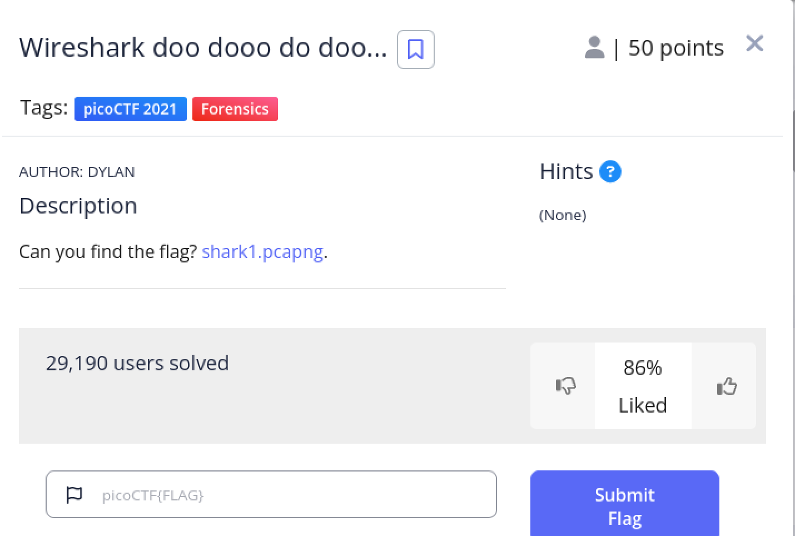
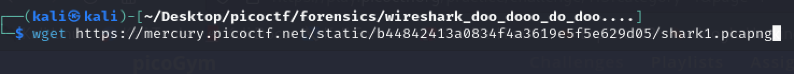
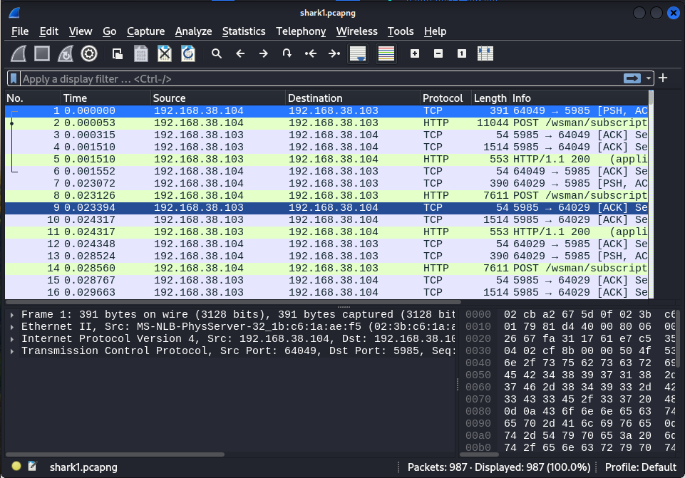
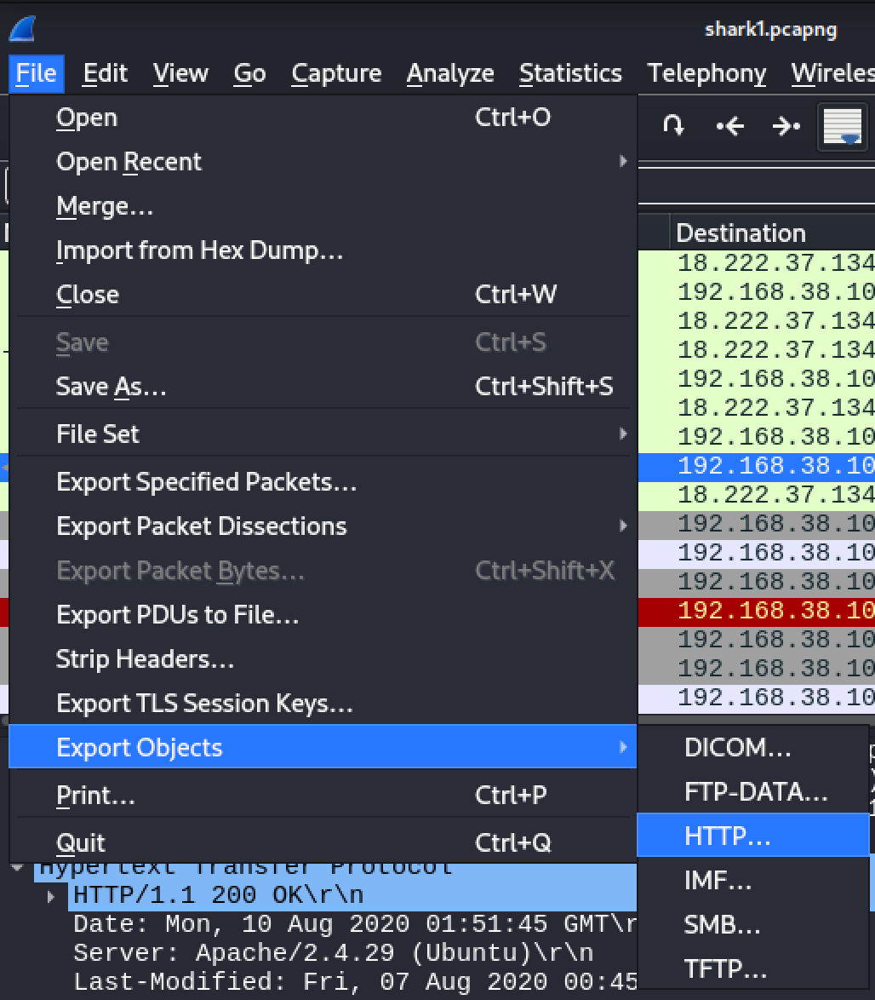
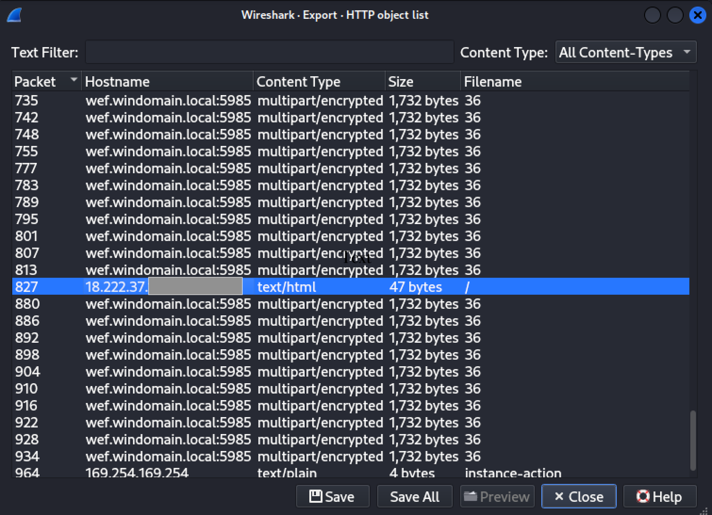
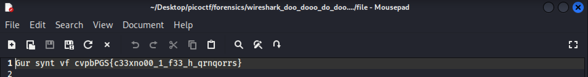
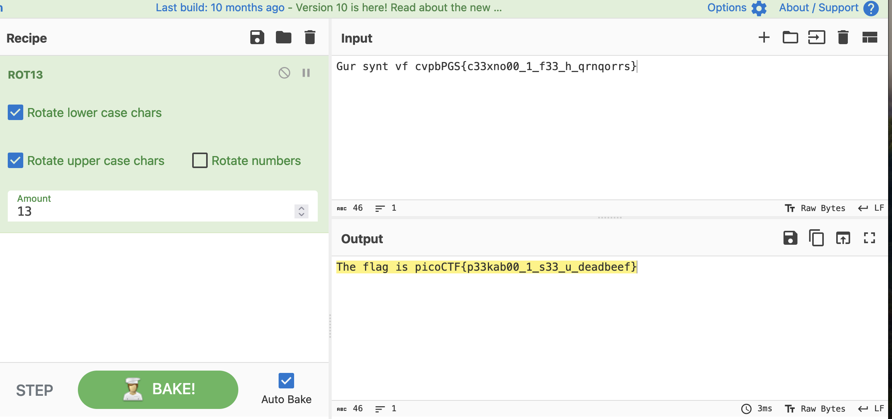
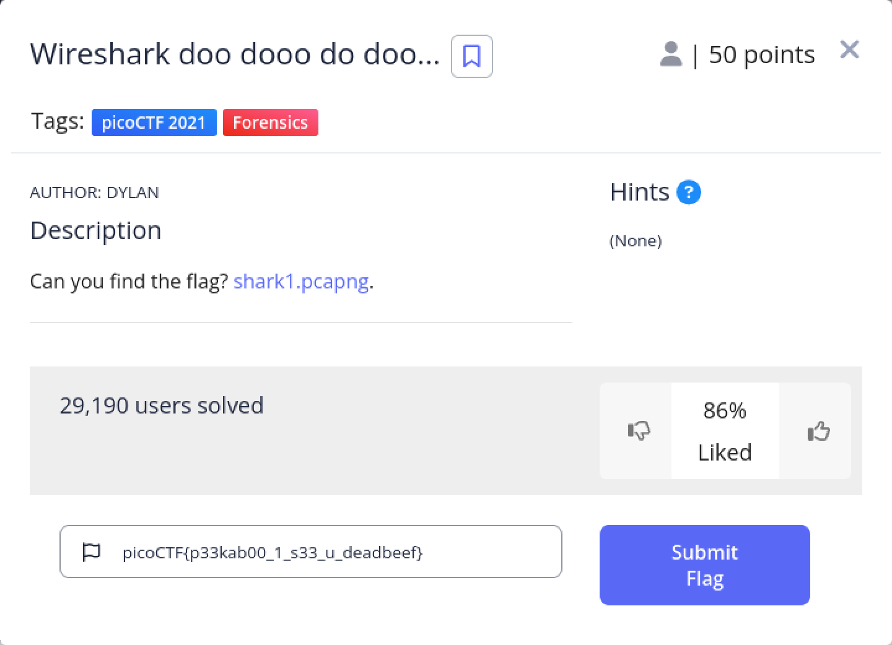

# Wireshark doo dooo do doo... (CTF Challenge Writeup)

## Description

This challenge, **Wireshark doo dooo do doo...**, was part of picoCTF 2021 in the **Forensics** category and is valued at **50 points**, indicating an easy-to-medium difficulty level. The task involved analyzing a network capture file (`shark1.pcapng`) with Wireshark to uncover a hidden flag. Essentially, the challenge tests basic packet analysis skills by having participants inspect captured traffic, extract key information, and apply a simple decryption to reveal the flag.

**Challenge Overview:**  
The first screenshot shows the challenge prompt on the picoCTF platform. It displays the challenge title “Wireshark doo dooo do doo…” along with its category (Forensics) and the instruction “Can you find the flag? shark1.pcapng.” This sets the objective: download and analyze the provided PCAP file to locate the hidden flag.

**Downloading the PCAP File:**  
This image shows the use of a command line tool (like wget) to download the PCAP file. It emphasizes that contestants need to retrieve the file as the first step before any analysis can be done.

**Displaying the PCAP File:**  
Here, the PCAP file is opened and displayed in Wireshark. The screenshot demonstrates the typical interface with a list of packets captured during network traffic, which sets the stage for further investigation.

**Exporting HTTP/Text Files:**  
This image captures the process of exporting parts of the capture—specifically HTTP or text files—from Wireshark. The goal is to isolate the encoded message (displayed in ROT13) for further analysis.

**Screenshot 5 – Highlighting an IP Address:**  
In this screenshot, attention is drawn to a file that contains an IP address (18.222.37.xxx). This step likely indicates that the traffic from this specific IP holds the important data or flag.

**Opening the Text File to Decode:**  
This image shows the text file that was exported from the capture. The file contains the encoded string that looks like a flag. It confirms that the hidden message has been isolated and is ready for decoding.

**Decoding with CyberChef:**  
The final screenshot depicts the use of CyberChef, a web-based tool for decoding and data analysis, to decode the ROT13 text. By applying CyberChef’s ROT13 operation, the encoded message is transformed into a readable flag.

**Final Challenge Page:**  
This final screenshot shows the picoCTF challenge page where the flag picoCTF{p33kab00_1_s33_u_deadbeef} is ready to be submitted. It also indicates the challenge’s point value (50 points), the number of users who solved it, and the community rating. The screenshot confirms that the discovered flag is correct and can be submitted successfully.

## Summary

In summary, the “Wireshark doo dooo do doo...” challenge from picoCTF 2021 required forensic analysis of a network capture file (`shark1.pcapng`) using Wireshark. By applying a targeted filter on TCP stream 5, we isolated HTTP traffic that contained an encoded string. Following the stream, we uncovered the suspicious text `Gur synt vf cvpbPGS{c33xno00_1_f33_h_qrnqorrs}`, recognized it as ROT13, and decoded it to reveal the flag: `picoCTF{p33kab00_1_s33_u_deadbeef}`. This challenge demonstrated key skills in packet analysis and simple decryption, reinforcing how encoded data can be hidden in plain sight within network captures.

